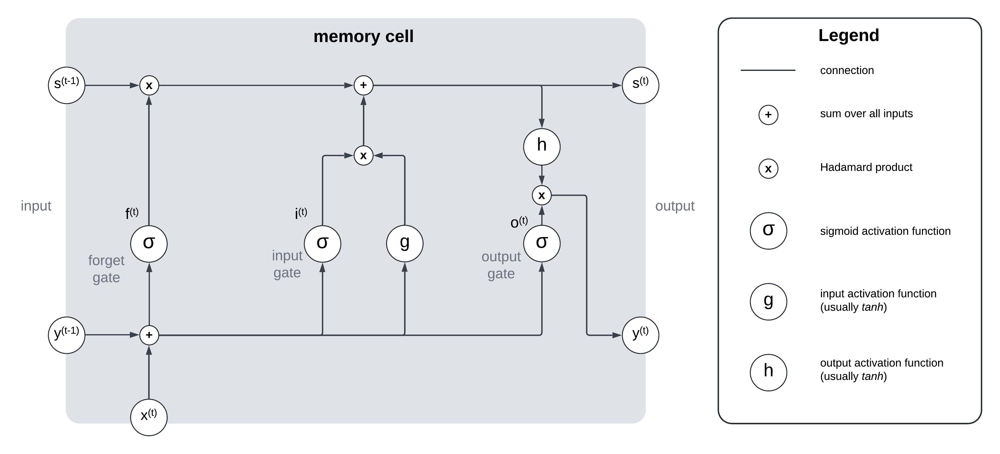
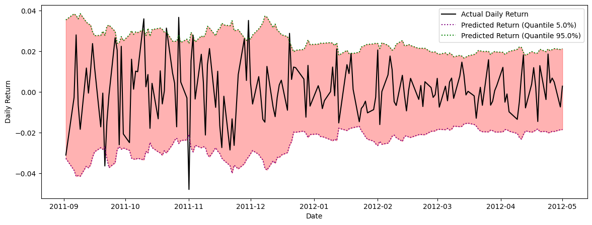

# Probabilistic Time Series Forecasting

This repository contains the code and results for a bachelor thesis project on probabilistic time series forecasting with a focus on financial data. The project compares classic econometric models (GARCH) and deep learning approaches (Quantile LSTMs) for generating prediction intervals of stock returns.

---

## Project Overview

Forecasting the future, especially in finance, requires not just accurate predictions but also a quantification of uncertainty. This project investigates two major approaches:

- **GARCH models** (Generalized Autoregressive Conditional Heteroscedasticity):  
  Widely used in econometrics to model time-varying volatility in financial time series.

- **Quantile LSTM neural networks** (Long Short-Term Memory networks trained with quantile regression):  
  Modern deep learning models that leverage LSTM’s ability to model sequences, extended to predict conditional quantiles directly, enabling the construction of prediction intervals.

The goal is to evaluate and compare their ability to produce reliable and informative prediction intervals.

---

## Suggested Repository Structure

A clean and reproducible structure is recommended:

```
Probabilistic-Time-Series-Forecasting/
│
├── src/                  # Python code for data loading, modeling, training, and evaluation
│   ├── data/             # Data loading and preprocessing scripts
│   ├── models/           # Implementation of GARCH and Quantile LSTM models
│   ├── train.py          # Training entry script
│   ├── evaluate.py       # Evaluation and result generation
│   └── hyperparameter_tuning.py  # Hyperparameter optimization
│
├── notebooks/            # Jupyter notebooks for analysis and experimentation
│   └── garch_analysis.ipynb  # GARCH diagnostic analysis and visualizations
│
├── Graphics/             # Project figures and result plots
│   └── LSTM_v2.png       # LSTM cell illustration (see below)
│
├── requirements.txt      # List of dependencies
├── README.md             # This file
└── .gitignore
```

---

## Background

### Why Probabilistic Forecasting?

Traditional forecasts often provide a single "best guess" (point forecast), but in uncertain environments—like stock markets—knowing the *range* of possible outcomes is crucial.  
**Probabilistic forecasting** delivers prediction intervals, quantifying the uncertainty and supporting better decision-making.

### GARCH Models

Financial returns typically exhibit volatility clustering—periods of high and low variance. GARCH models are designed to capture this. The idea is that the conditional variance (volatility) at time \( t \) depends on both previous squared returns and previous variances:

```
σ²ₜ = α₀ + α₁·X²ₜ₋₁ + ... + αₚ·X²ₜ₋ₚ + β₁·σ²ₜ₋₁ + ... + β_q·σ²ₜ₋_q
```

- \( σ²ₜ \): conditional variance at time \( t \)
- \( Xₜ \): return at time \( t \)
- \( α_j, β_j \): model parameters

This allows for prediction intervals that adapt to changing market volatility.

### Quantile Long Short-Term Memory (LSTM) Networks

Long Short-Term Memory (LSTM) networks are a special type of recurrent neural network (RNN) able to recognize patterns in sequences of data, such as time series.  
By training LSTMs with the **pinball (quantile) loss**, they learn to directly predict conditional quantiles, which allows for the construction of prediction intervals.

Pinball (quantile) loss:

```
Lₐ(y, ŷ) =  α·(y - ŷ)   if y > ŷ
          (1-α)·(ŷ - y) if y ≤ ŷ
```

#### LSTM Memory Cell Structure

Below is a schematic of the LSTM memory block, which enables learning of long-term dependencies and selective memory updates:



*Figure: Structure of an LSTM (Long Short-Term Memory) memory block.*

- **Forget gate**: Decides which information to discard
- **Input gate**: Decides what new information to store
- **Output gate**: Controls what to output from the cell

---

## Experimental Setup

- **Data**: Daily stock returns (and trading volumes) from selected S&P 500 industrials, 2009–2019.
- **Modeling**: Both GARCH and quantile LSTM models are trained and evaluated on the same datasets.
- **Metrics**:
  - **PICP**: Prediction Interval Coverage Probability
  - **PINAW**: Prediction Interval Normalized Average Width
  - **CWC**: Coverage Width Criterion (combines width and coverage)

---

## Results Summary

Performance of both models is summarized using the **Coverage Width Criterion (CWC)** metric, which considers both interval width and coverage probability. A selection of representative results is provided below:

### Key Findings:

#### Period 1:
- **GARCH Performance**: Outperformed Quantile LSTM in most stocks.
- **Quantile LSTM**: Failed to consistently achieve the desired coverage level.

#### Period 2 and 3:
- **Quantile LSTM Improvements**: Incorporating trading volume as a feature improved performance but still lagged behind GARCH overall.

### Visual Example of Performance:
Predicted intervals of the QLSTM model for stock returns (Northrop Grumman, Period 1):



---

## Outlook: Conformal Prediction

One limitation of quantile regression is the lack of finite sample guarantees for prediction intervals. Future work could explore **conformal prediction** to improve reliability. Conformal prediction adjusts intervals based on past prediction errors, ensuring valid coverage irrespective of sample size. This method could be integrated with Quantile LSTM models to enhance their robustness.

---

## References

A selection of key references:

1. Aggarwal, C. (2023). *Neural Networks and Deep Learning*. Springer.
2. Bollerslev, T. (1986). Generalized Autoregressive Conditional Heteroscedasticity. *Journal of Econometrics*, 31(3), 307–327.
3. Kingma, D. P., & Ba, J. (2014). Adam: A method for stochastic optimization. *arXiv preprint arXiv:1412.6980*.
4. Koenker, R., & Bassett, G. (1978). Regression Quantiles. *Econometrica*, 46(1), 33–50.
5. Van Houdt, G., Mosquera, C., & Nápoles, G. (2020). A review on the long short-term memory model. *Artificial Intelligence Review*, 53(8), 5929–5955.

---

